# Faded Dream ToolKit (FDK)

FDK is a native C17 GUI toolkit being built for modern Linux desktops,
targeting the practical role GTK and Qt currently serve for
applications that choose to target it. Minimal dependencies, no
GTK/Qt dependency, real X11 and Wayland backends, and its own `.fdk`
theme format (shipped in Phase 7). See `docs/roadmap.md` for the
full project plan and current status.

FDK is **distro-agnostic**: it should build and run on any modern
Linux distribution where its genuinely unavoidable system interfaces
(X11 protocol, Wayland protocol, POSIX) are available. It is not
designed around any specific distribution.

**Status: 1.1.1 — all eleven roadmap phases COMPLETE, ABI frozen; the no-bus policy + embedded narrator landed; the Wayland deferred-first-frame fix and the consolidated example suite.**

**Fonts:** FDK bundles no font (licensing posture). The demos and
`fdk_font_load_system_default()` discover a system UI font through
fontconfig (loaded at run time — no build or link dependency), the
standard font directories, or `$FDK_FONT_FILE` / `$FDK_FONT_DIRS`
overrides; see `docs/text.md`. Any distro layout works, including
Arch's variable-font `NotoSans[wdth,wght].ttf` naming.

Core lifecycle, real X11 and Wayland backends, the rendering layer
(damage-tracked software renderer with images, alpha compositing,
transforms, and antialiasing), the widget foundation with layout
(box + grid), the text stack (TrueType shaping with subpixel
positioning), the core widget catalog, the theme engine
(runtime-switchable `.fdk` files), FDK-drawn window decorations with
full window management, the advanced widget phase — clipboard, text
Entry (now with password/read-only/max-length modes), ScrollView,
List, Tree, Slider, SpinButton, Toolbar, Notebook, Canvas, Menu,
ComboBox, and modal dialogs — the accessibility core (describe /
notify / perform over the widget tree itself), the embedded narrator
— FDK's in-process screen reader core: no D-Bus, no registry, no
bridge process, just an application-wired sink that receives the
narrated focus/toggle/value utterances (the no-bus policy,
`docs/dependencies.md`) — and the complete i18n
engine: explicit-locale formatting (numbers with Western/Indian/
Swiss/Arabic grouping, currency, percent), an exact proleptic-
Gregorian calendar with pattern-driven date/time formatting in 15
languages, CLDR plural rules for 33 languages, and strict, bounded
`.fmo` translation catalogs with context and plural support — and
the Phase 11 stabilization pass: layout batching (515x faster bulk
tree construction), the performance baseline harness, the ABI audit
with compile-time size assertions and the subclassing decision,
the memory-safety audit, pkg-config packaging, and the 1.0.0 ABI
freeze (`FDK_ABI_STABLE` = 1). See "What works today" below and
`docs/roadmap.md` for an honest, specific list of what is and isn't
covered.

After `make install`, link applications with
`cc myapp.c $(pkg-config --cflags --libs fdk)`.

## Requirements

- GCC with C17 support (developed against GCC 13+; any reasonably
  current GCC should work — see `docs/build.md`)
- X11 development headers (always required — X11 is FDK's baseline
  backend, see `docs/dependencies.md`)
- Optional: Wayland development headers (`libwayland-dev`,
  `wayland-protocols`, `libxkbcommon-dev`) — auto-detected at build
  time; if absent, FDK builds as X11-only and the runtime
  FDK_PLATFORM_WAYLAND selection fails cleanly with FDK_ERR_NO_DISPLAY
- `Xvfb`, optionally, only if you want to run `make test-x11`
  without an existing desktop session

## Building

```sh
make            # debug build (ASan+UBSan on by default)
make test       # platform-independent test suite (no display needed)
make test-x11   # X11 integration test suite (real window lifecycle,
                # auto-starts a throwaway Xvfb if $DISPLAY isn't set)
make examples   # build the example programs
```

To require the Wayland backend at build time (rather than the default
auto-skip when its dev headers are missing):

```sh
make FDK_ENABLE_WAYLAND=1   # errors if wayland-dev / xkbcommon-dev absent
```

To force-build X11-only even on a system with Wayland dev headers:

```sh
make FDK_DISABLE_WAYLAND=1
```

See `docs/build.md` for the full command reference, including
release builds, `make install`, and the optional-build knobs in
detail.

## What works today

```c
#include "fdk/fdk.h"
#include "fdk/fdk_event.h"
#include "fdk/fdk_window.h"

static void on_event(fdk_window *window, const fdk_event_data *event, void *user_data) {
    fdk_context *ctx = user_data;
    if (event->type == FDK_EVENT_WINDOW_CLOSE_REQUEST) {
        fdk_window_destroy(window);
        fdk_quit(ctx);
    }
}

int main(void) {
    fdk_context *ctx = NULL;
    fdk_init(&ctx, NULL); /* connects to a real X11 or Wayland display */

    fdk_window *window = NULL;
    fdk_window_options opts = { .title = "Hello", .width = 640, .height = 480 };
    fdk_window_create(ctx, &opts, &window);
    fdk_window_set_event_callback(window, on_event, ctx);
    fdk_window_show(window);

    fdk_run(ctx); /* real poll()-based event loop */
    fdk_shutdown(ctx);
    return 0;
}
```

Run `examples/01_hello_world.c` (via `make examples`) to see a fuller
version of this — it opens a real window, logs resize/keyboard events,
and exits cleanly when closed. It needs a reachable X11 or Wayland
display to run.

Rendering works today too — Phase 3's second slice. The window's
`fdk_surface` gives you a CPU framebuffer (XRGB8888) that survives
resizes, a blending primitive set (fills, rects, gradients, lines,
circles, rounded rects), a clip stack, offscreen surfaces, blits —
and presents send only what changed:

```c
fdk_surface *surface = NULL;
fdk_window_get_surface(window, &surface);

while (!done) {
    fdk_pump_events(ctx, 15);              /* own the loop */
    if (!fdk_surface_frame_ready(surface))
        continue;                          /* compositor-paced (Wayland) */
    fdk_surface_info info;
    fdk_surface_get_info(surface, &info);  /* pixels + size + stride */
    /* draw via helpers or info.pixels directly; helpers record
     * damage automatically; raw writers call fdk_surface_invalidate */
    fdk_surface_fill_gradient_vertical(surface, full_rect, top, bottom);
    fdk_surface_present(surface);          /* sends only the damage;
                                              no-op if nothing changed */
}
```

Run `examples/02_rendering.c` to see this live: a gradient-and-
logo primitives panel where a bouncing ball updates at 1-2% of the
window's damage per frame (the console prints the live damage
statistics), plus image decoding, transforms, antialiased shapes,
and alpha compositing panels — all software, all damage-tracked.
Identical code on X11 and Wayland; on Wayland the loop is
additionally paced by the compositor's frame callbacks. The ball
animates for a short intro and then freezes — an idle FDK app costs
zero presents. Windows that nobody renders into still show the
plain platform background. See `docs/rendering.md` for the full
rendering design.

And widgets work today too — Phase 4's foundation. Attach a tree to
the window's root widget and FDK does the retained-mode work:
hit-testing, hover and enter/leave synthesis, the implicit pointer
grab, focus with built-in Tab traversal, event bubbling, and
damage-driven repaints that clip to exactly what changed:

```c
fdk_widget *root = NULL;
fdk_window_get_root(window, &root);

fdk_widget *button = NULL;
fdk_widget_create(root, NULL, (fdk_rect){20, 20, 120, 48}, &button);
fdk_widget_set_background(button, panel_color);
fdk_widget_set_corner_radius(button, 8);
fdk_widget_set_can_focus(button, true);
fdk_widget_set_event_callback(button, on_button_event, &state);

while (!done) {
    fdk_pump_events(ctx, 15);   /* input routed into the tree */
    fdk_window_paint(window);   /* repaint damage only + present */
}
```

A widget that handles an event consumes it — the window-level
callback only sees what the tree didn't. Widgets can destroy
themselves, their ancestors, or the whole window from inside an event
callback; the core defers the frees so no dispatcher ever walks freed
memory. Run `examples/04_widgets.c` for a live catalog of real
controls with hover, press, focus-tint, and a quit button — every
interaction state the foundation routes.

Layout works today too — Phase 5, complete. Boxes (horizontal or
vertical) lay children out from per-child requests and hints —
margins, expansion, cross-axis alignment, BASELINE alignment — and
the GRID places children in (column, row) cells with spans, per-
track expansion, and homogeneous mode; per-widget MIN/MAX size
limits clamp every measure so any container negotiates within
them. The classic two-pass measure/arrange model underneath it all,
and the window's CONTENT widget reflows automatically on every
resize — on X11 AND Wayland (a client-side resize re-arranges the
tree and reaches the compositor's screen):

```c
fdk_widget *content = NULL;
fdk_box_create(root, FDK_VERTICAL, &content);
fdk_box_set_padding(content, 12);
fdk_box_set_spacing(content, 10);
fdk_window_set_content(window, content);   /* auto-reflow on resize */

fdk_widget *header = NULL;
fdk_widget_create(content, NULL, (fdk_rect){0, 0, 0, 40}, &header);
/* bounds are size REQUESTS now — layout assigns the real geometry */
fdk_widget *main_area = NULL;
fdk_widget_create(content, NULL, (fdk_rect){0, 0, 0, 50}, &main_area);
fdk_widget_set_expand(main_area, false, true);   /* take the leftover */
```

Run `examples/04_widgets.c` and look at the "Layout — grid" frame:
a 3-column grid with a two-column spanning cell and an expanding
last column — resize the window and watch ONLY that column absorb
the width while the other tracks and the gaps stay exactly
`spacing` pixels. The whole panel is built from boxes and the grid;
nothing is placed by hand, and every child reflows live through
configure -> relayout -> damage -> repaint.

And text renders for real now — Phase 6, complete. Load a
TrueType font, measure a UTF-8 run (advance + ink bounds), and draw
it kerned and anti-aliased onto any surface with SUBPIXEL glyph
positioning (four phase-keyed rasterizations per glyph — every glyph
paints within 1/8 px of where the pen actually is); measurement and
drawing share one shaping walk, so what you measure is exactly
where it paints. Synthetic BOLD and ITALIC styles ride the font
object (`fdk_font_set_style`) — stems widen and the advance grows
with them, italic shears at the baseline without touching the
advance. Glyphs rasterize once per (glyph, phase) and live in an
LRU cache; each run costs a single damage rectangle:

```c
/* Explicit path — full control when you ship your own face: */
fdk_font *font = fdk_font_load("/usr/share/fonts/truetype/dejavu/DejaVuSans.ttf", 24);

/* Or discover the system default (fontconfig, font dirs, or
 * $FDK_FONT_FILE override — see docs/text.md): */
fdk_font *ui = fdk_font_load_system_default(24);
printf("picked %s\n", fdk_font_get_file_path(ui));

fdk_text_metrics m;
fdk_font_measure_utf8(font, "Hello, FDK", 10, &m);   /* advance + ink box */

fdk_surface_draw_utf8(surface, font, "Hello, FDK", 10,
                      40, 120, (fdk_color){1, 1, 1, 1});  /* pen, baseline */
```

Run `examples/03_text.c`'s canvas half: a 96px wordmark, a size
ladder, colored runs chained by measured advances, a per-glyph
wave line, and a live glyph-cache stats footer — all drawn straight
through `fdk_surface_draw_utf8`.

And the core widget catalog — Phase 6's main event. Eight real
widgets on the Phase 4 object model, sized by their measured text
and driven by the same event routing as everything else:

```c
fdk_widget *btn = NULL;
fdk_button_create(frame, font, "Apply", &btn);
fdk_button_set_on_activate(btn, on_apply, NULL);   /* click OR Space */

fdk_widget *opt = NULL;
fdk_radio_create(frame, font, "Software (auto)", &opt);
fdk_radio_set_checked(opt, true);  /* siblings in the parent uncheck */

fdk_progress_set_fraction(bar, 0.75f);
```

Label, Button, Toggle, Checkbox, RadioButton (its group IS its
parent widget), ProgressBar, Separator, and Frame — a titled
container whose children arrange below the title band automatically.
Controls activate on release-inside after a press (the implicit grab
keeps the release even if the pointer left), answer Space/Enter when
focused, and dim + go input-transparent when disabled.

Run `examples/04_widgets.c`: a settings-style panel built entirely
from the catalog — frames of controls, a radio group, a grid, a
button row, a progress bar, and a live status label that every
control reports into.

Text layout completes the picture — labels that wrap, truncate with
an ellipsis exactly at their right edge, and align their lines:

```c
fdk_label_set_mode(body, FDK_LABEL_WRAP);      /* greedy word-wrap  */
fdk_label_set_mode(path, FDK_LABEL_ELLIPSIZE); /* "..." at the edge */
fdk_label_set_alignment(title, FDK_ALIGN_CENTER);

fdk_font_break_lines_utf8(font, text, len, width, NULL, 0, &n, NULL);
/* -> n lines, each measured by the same walk that paints it */
```

Radio groups own their arrow keys: Up/Left and Down/Right move the
selection through the group (wrapping, skipping hidden/disabled
members) with focus following — Space still toggles, Tab still
traverses the whole tree.

Run `examples/03_text.c`'s widget half: a wrapping paragraph that
reflows taller when the window narrows, a truncated path line, the
three alignments, and a keyboard-owned radio group — one window
with the raw-rendering gallery above it.

And the theme engine — the whole toolkit restyles at runtime, from
data:

```c
fdk_theme *t = fdk_theme_load("my-theme.fdk", NULL); /* strict .fdk */
fdk_theme_set_default(t);   /* every live window repaints, themed  */
```

Ten color tokens (text, control surfaces with hover/pressed/
disabled states, accent, track, border) and two paint metrics
(button corner radius, separator thickness) resolve at paint time,
so a theme switch is one call — no cached colors, no tree walk by
the app. The built-in default theme is the Phase 6 palette exactly:
never touching themes changes no pixels. Themes parse from memory or
disk with a strict, bounded, fail-closed grammar
(`docs/fdk-theme-format.md`; the security rules behind it are
`docs/security.md`) — unknown keys, duplicates, and malformed values
are errors with line numbers, never half-themed UI. Missing tokens
inherit the built-in defaults, so a three-line theme is a real
theme.

Run `examples/05_theme.c` (from the repository root — it loads
`examples/data/daylight.fdk` and `examples/data/matrix.fdk`): one
panel of catalog widgets cycling through three themes with real
clicks, including the app-side pattern for tokens the engine does
not force on anyone (window background, label accents).

And FDK-drawn window decorations plus full window management — the
toolkit owns its title bar:

```c
fdk_window_set_decorated(window, true);  /* themed band + buttons  */
fdk_window_maximize(window);             /* request; state events */
```

A themed band inside the client area (height is the
`title_bar_height` theme metric) with the window title and three
vector-glyph buttons — minimize, maximize/restore, close — that
render with or without fonts. The close button delivers a normal
close-request (application semantics unchanged); double-clicking the
band toggles maximize; a 5px edge/corner zone resizes the window
(since the WM frame is gone, FDK provides the handles). The
platform's own chrome is asked away — `_MOTIF_WM_HINTS` on X11,
xdg-decoration on Wayland — and where the platform has a protocol
for it, drags and state changes are HANDED to the WM/compositor
(EWMH `_NET_WM_STATE` / `_NET_WM_MOVERESIZE`, `xdg_toplevel`
requests); under bare X (no WM) FDK performs them itself. State
truth arrives as `FDK_EVENT_WINDOW_STATE`, never request optimism;
on Wayland a compositor that insists on its own decorations comes
back as `FDK_EVENT_WINDOW_DECORATION` and FDK drops its band before
you see the event — a window can never end up with two title bars.

Run `examples/06_decorations.c`: a decorated window you can drag by
its band, double-click to maximize, resize by its edges, manage by
its buttons, and close by its button — with a runtime toggle between
FDK-drawn and platform decorations.

### Images, alpha compositing, transforms, antialiasing (Phase 3
### completion)

Run `examples/02_rendering.c`: four panels — a PNG decoded from disk and
composited with per-pixel alpha (the file's 50%-transparent band
actually blends over the panel background), the same image through
the transform pipeline (exact 2x integer block scaling, a slowly
rotating bilinear copy, an enlarged fractional scale), crisp vs
antialiased primitives side by side, and a runtime-built transparent
sprite blended twice so the alpha visibly ACCUMULATES where the two
copies overlap. On X11 this all travels through the MIT-SHM shared
memory path on a double buffer; on a scaled Wayland output the widget
layer composites through the logical intermediate while raw pixels
stay physical.

### The advanced widget phase — Phase 9, complete

Everything a real application needs for input and structure: a
clipboard architecture (real ICCCM selection ownership on X11,
`wl_data_device` on Wayland), a text Entry (cluster-safe cursor,
selection with the full modifier grammar, cut/copy/paste, password
mode, IME preedit groundwork), ScrollView with overlay scrollbars,
List and Tree with multi-select, Slider, SpinButton, Toolbar,
Notebook, Canvas — and the popup machinery that ties them together:

```c
fdk_menu *file = NULL;
fdk_menu_create(font, &file);
fdk_menu_item *it = NULL;
fdk_menu_append(file, "Open", &it);
fdk_menu_item_set_on_activate(it, on_open, NULL);
fdk_menu_append_check(file, "Show toolbar", true, NULL);

fdk_widget *bar = NULL;
fdk_menu_bar_create(window_content, font, &bar);
fdk_menu_bar_append(bar, "File", file);   /* bar + dropdowns + submenus */
```

Menus, submenus, and combo dropdowns are TOOLKIT-OWNED popup windows:
`fdk_window_create_popup` on the window layer (override-redirect +
input grabs on X11, `xdg_popup` with positioners on Wayland) with a
parent-relative position, a grab at show, and a close request on the
outside press — the widget layer creates them, auto-paints them, and
dismisses them. The app loop pumps events and paints ITS windows
only. Dialogs ride the same machinery: `fdk_dialog_show_message` is
non-blocking by design (nothing in FDK blocks the event loop), modal
on X11 through a real server-side pointer+keyboard grab (the test
suite verifies the grab by REFUSING a foreign grab while the dialog
lives), and honestly non-modal on Wayland where no toplevel-grab
protocol exists.

```c
fdk_dialog_options opts = {
    .title = "Discard changes?",
    .text  = "The file has unsaved changes.",
    .buttons = FDK_DIALOG_OK_CANCEL,
    .modal = true,   /* X11: server-side input grab; Wayland: ignored */
};
fdk_dialog_show_message(ctx, &opts, on_answer, NULL);
/* Enter answers OK, Escape answers Cancel, buttons answer themselves,
 * early destroy answers Cancel — exactly one on_response, always. */
```

Run `examples/07_advanced.c`: every Phase 9 control in one window —
a menu bar with submenus and a real message dialog, a toolbar, a
notebook of pages (controls, a list, a tree, a canvas), combos, a
status label narrating everything. The popups open, grab, and
dismiss themselves while the demo only pumps events.

### The accessibility core — Phase 10, first slice

The accessibility tree IS the widget tree — no parallel object
model, no daemon, nothing that can drift out of sync with what is
on screen. Every widget can be described, observed, and DRIVEN
without a display, which makes the layer testable headless and
gives FDK the automation seam GTK and Qt had to bolt on later:

```c
fdk_a11y_info info;
fdk_a11y_describe(slider, &info);
/* info.role == FDK_A11Y_ROLE_SLIDER
 * info.value_current / value_min / value_max, info.value_text
 * info.states: ENABLED | VISIBLE | SHOWING | FOCUSABLE ... */

fdk_a11y_subscribe(NULL, on_a11y_event, NULL);   /* global scope */
/* ... every children/state/name/bounds/value change, forever */

fdk_a11y_perform(slider, FDK_A11Y_ACTION_SET_VALUE, 55.0);
/* programmatic driving through the widget's own semantics — the
 * same code path the keyboard takes. Screen readers' "click" and
 * the test suite's assertions share this API. */
```

Thirty-four roles (WAI-ARIA/ATK naming), a 17-flag state set
(SHOWING walks ancestors — a hidden container hides its subtree),
a value interface (sliders, progress, spins, scrolls, entries,
notebooks, combos), per-widget accessible-name overrides over
class-computed names (a Label's text, a window's title), change
notifications with the same reentrancy discipline as the event
system, and action drivers for the whole interactive catalog. The
Entry also gained the three modes the roadmap had promised:
password (one bullet per cluster — the caret, selection, and
hit-testing never change), read-only (selection + copy keep
working), and max length. Since 1.1.0 the toolkit also ships its
own consumer: the embedded narrator — FDK's screen reader core
(`fdk_a11y_set_speaker` + `fdk_a11y_narrator_start`), which
narrates focus moves, toggles, and value changes through an
application-wired sink with no registry, no bus, and no bridge
process (the no-bus policy, `docs/dependencies.md`). An external
assistive-technology bridge, if an application wants one, is a
CONSUMER of the same public API; `docs/roadmap.md`'s Phase 10 entry
records exactly what is and isn't there. Run
`examples/08_narrator.c` to watch it live: a scripted tour walks
focus through a form while the narrator speaks each move through a
subtitle bar, then keeps narrating your own keyboard and pointer
interaction until you close the window.

### Internationalization — Phase 10, second half

One design rule: FDK never calls `setlocale()` and never reads the
environment — every function takes its locale as an explicit value,
so one process can format for a different locale per call, and every
result is deterministic under test:

```c
fdk_locale de, hi, ar, ja, ru, pl;
fdk_locale_parse("de", &de);        /* BCP-47 AND "de_DE.UTF-8" work */
fdk_locale_parse("hi", &hi);
fdk_locale_parse("ar", &ar);
fdk_locale_parse("ja", &ja);
fdk_locale_parse("ru", &ru);
fdk_locale_parse("pl", &pl);

char buf[96];
fdk_format_int(buf, sizeof buf, &de, 1234567, NULL);   /* 1.234.567  */
fdk_format_int(buf, sizeof buf, &hi, 12345678, NULL);  /* 1,23,45,678 */
fdk_format_int(buf, sizeof buf, &ar, 1234567, NULL);   /* ١٬٢٣٤٬٥٦٧  */

fdk_format_currency(buf, sizeof buf, &de, 1234.5, "EUR"); /* 1.234,50 € */
fdk_format_date(buf, sizeof buf, &ja, &(fdk_date){2025, 12, 25},
                FDK_DATE_LONG);                          /* 2025年12月25日 */

/* CLDR plurals — 33 languages, every rule shape: */
fdk_plural_category_int(&de, 1);   /* FDK_PLURAL_ONE   */
fdk_plural_category_int(&ru, 21);  /* ONE (Russian 21 is singular!) */
fdk_plural_category_int(&pl, 21);  /* MANY (Polish 21 is NOT)      */

/* Translation catalogs: strict, bounded .fmo files (the theme
 * parser's discipline — unknown anything is a line-numbered error),
 * with contexts and category-named plural forms: */
fdk_catalog *cat = NULL;
fdk_catalog_load("src/de.fmo", &cat);
const char *tmpl = fdk_translate_plural(cat, &de, "%d file",
                                        "%d files", n);
snprintf(buf, sizeof buf, tmpl, n);   /* the app formats; FDK
                                       * never interprets strings */
```

The calendar is the proleptic Gregorian year 1..9999 on exact
civil-day integer math (no time_t, no leap-year folklore), the
month/weekday names ship for 15 languages — inflected FORMAT forms
where the language requires them ("25 декабря", not "декабрь") —
and number formatting covers Western, Indian (1,23,45,678), Swiss
(1'234'567), and Arabic-Indic grouping with their separators and
digits. `docs/i18n.md` records the whole design and the honest
deviations from full CLDR data.

### What it looks like

Since 1.1.1 the whole example suite runs on both backends under the
test rigs, and the captures below are real compositor output from
sway (headless, wlr-screencopy) — every example launched in the same
show -> paint -> pump order a real application uses, screenshot-
verified, then closed through the real close path. (This rig exists
because 1.1.0 shipped a Wayland bug where exactly that ordering
never mapped a window — see the platform notes in
`docs/architecture.md`.)

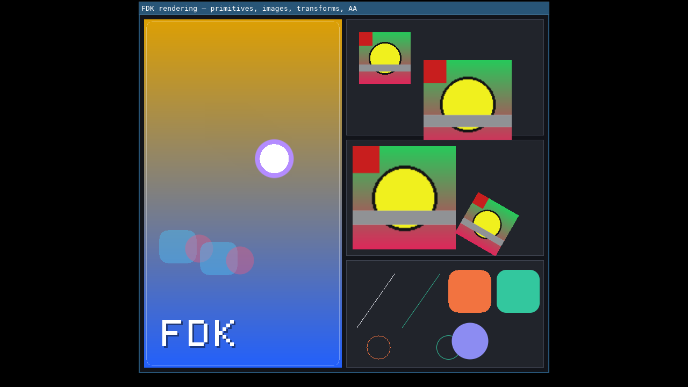

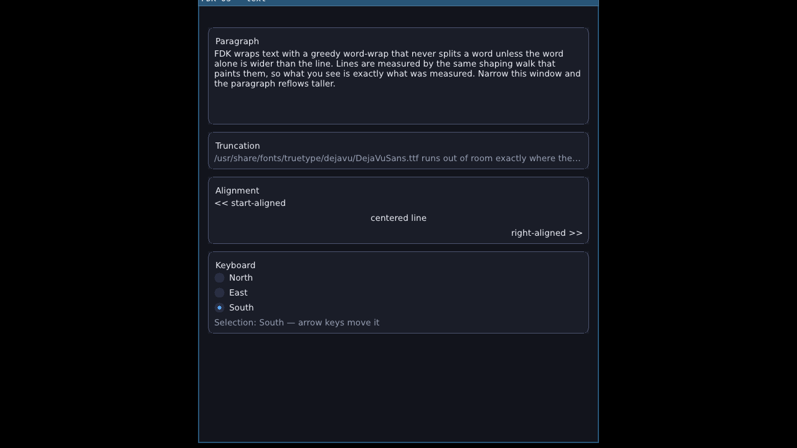

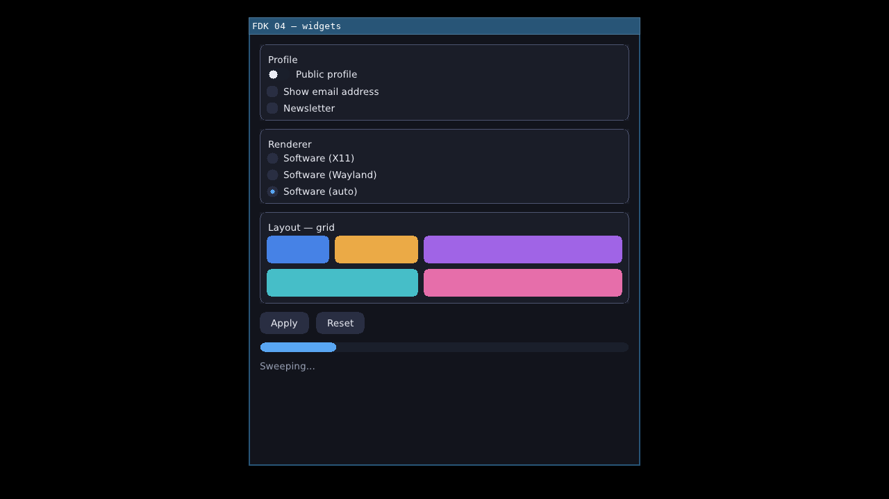

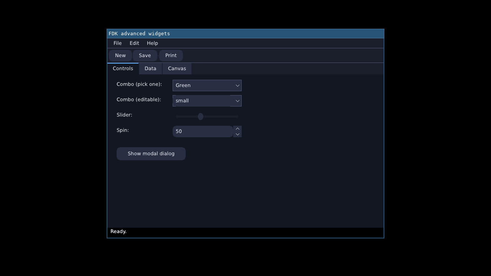

The earlier per-feature proofs below were captured with the same
discipline while each subsystem landed (Xvfb + `x11grab`, or the
weston/sway compositor screenshot paths; some show example names
from before the suite was consolidated to eight programs — the
feature proofs are unchanged):

These are real captured frames from the test rig — not mockups. The
first two are the X11 backend (Xvfb display, `x11grab` capture): the
demo window at 640x480, and again after a live resize to 800x600 —
the framebuffer follows the resize and the ball/logo reposition into
the new bounds. The dark area around each window is the bare Xvfb
root window, kept in frame on purpose: it shows the window boundary
is real.

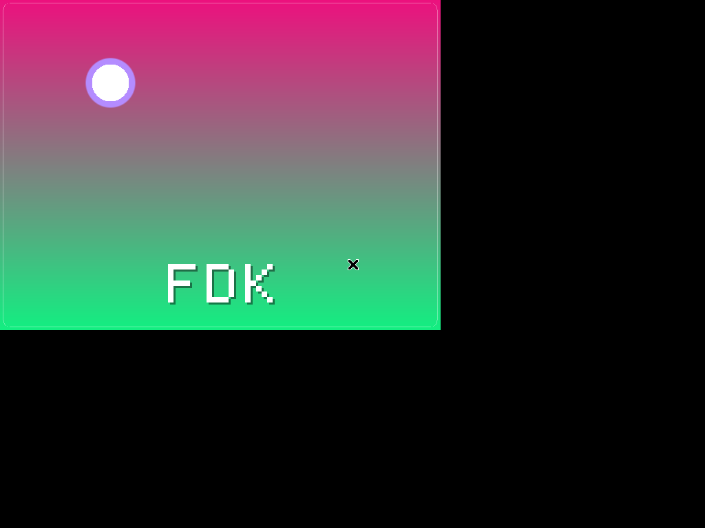

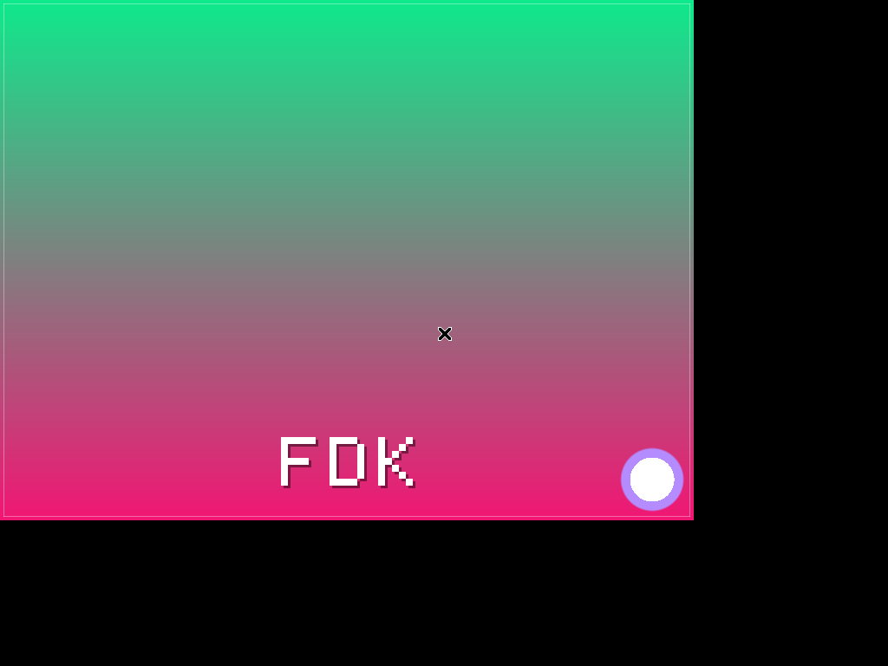

The next two are the same example running under Wayland (weston 14,
headless backend, compositor screenshot), captured 3.5 seconds apart.
The gradient occupies the whole frame because the kiosk shell
configures the surface fullscreen; the shifted colors between the two
frames show the animation genuinely advancing frame by frame on the
Wayland present path.

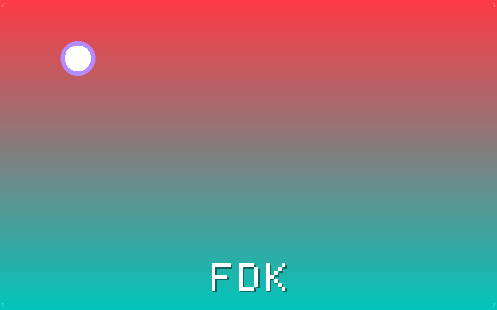

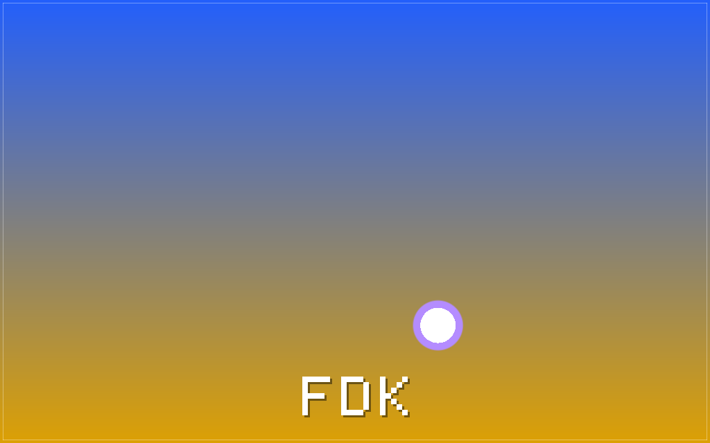

A 10-second screencast of the animated X11 session — including the
live resize and a clean window close mid-render — is committed
alongside the stills:
[`docs/screenshots/fdk_render_x11.mp4`](docs/screenshots/fdk_render_x11.mp4).

The widget foundation has its own captured proof — two frames of the
Phase 4 foundation demo (since folded into the widget catalog,
`examples/04_widgets.c`) under Xvfb, driven by real injected input
(XSendEvent through the X server): the initial state, and after two
button clicks plus a Tab. Between the frames the meter recolored AND
grew (a `set_bounds` layout change repainting only the affected
region), and the "hue" button's color shifted because keyboard focus
moved to it. The quit button ends the demo by destroying the window
from inside its own pointer-release handler — and the process exits
cleanly (exit 0, ~390 frames).

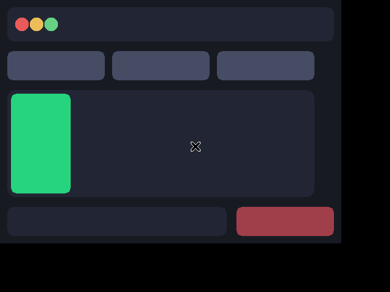

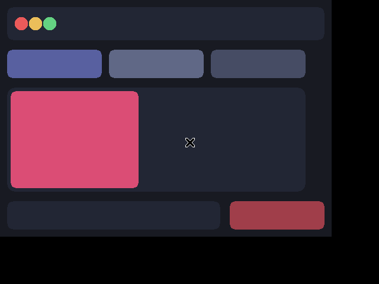

And the layout engine's proof — the layout demo (its grid now lives
in the "Layout — grid" frame of `examples/04_widgets.c`) held at two
different window sizes (660x480 and 500x380), captured during its
steady phases: the header dots stay anchored top-left, the expanding
panel owns whatever space the window gives it, the footer stays
pinned to the bottom. Nothing in the example computes geometry by
hand.

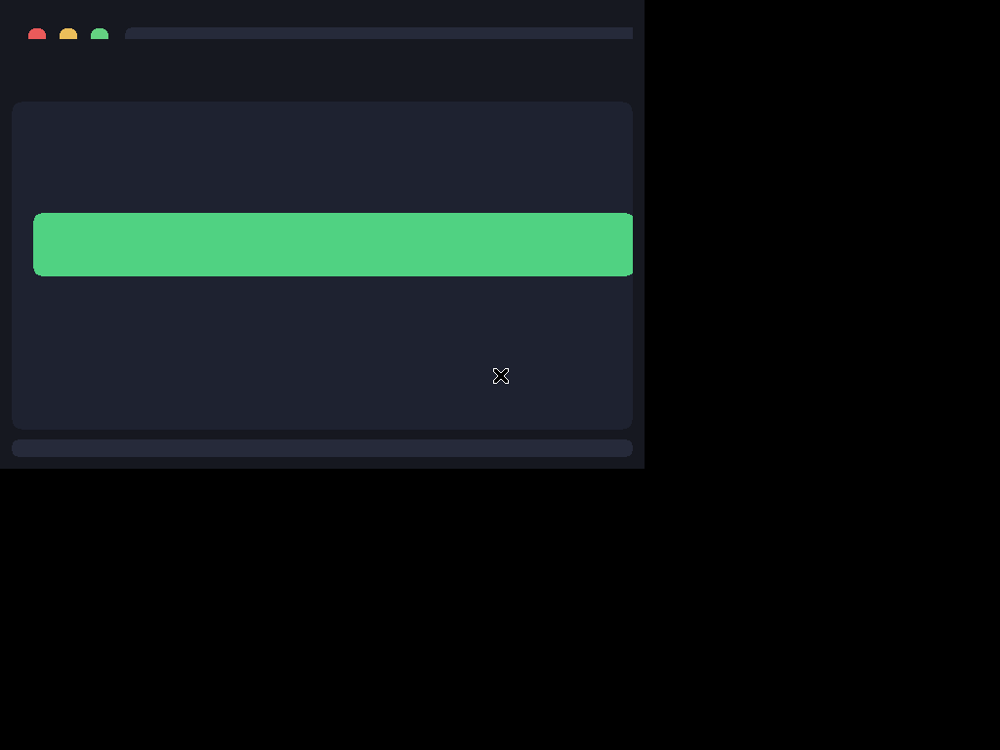

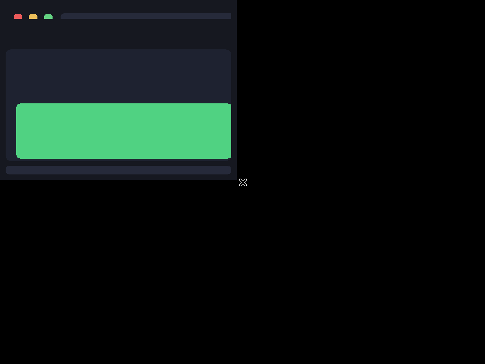

And the text foundation's proof — the raw-rendering half of
`03_text` in its deterministic hold frame (real shaped glyphs,
PIL-verified down to the colored runs and the stats footer):

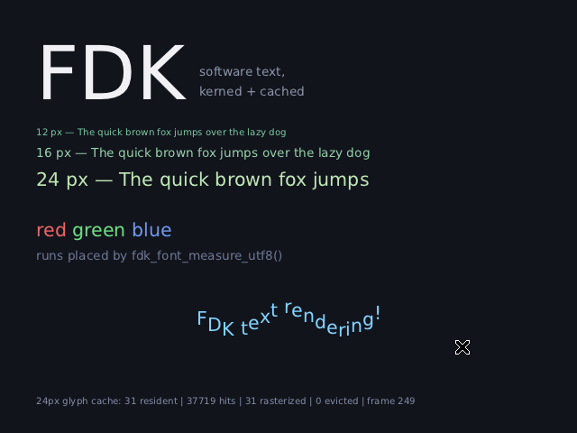

The widget catalog's proof — `04_widgets` in its deterministic hold
frame: two frames (Profile / Renderer) with real title bands, a
toggle, checkboxes, a checked radio (the accent dot), buttons, a
full progress bar, and the status label — every element PIL-verified
by the test rig:

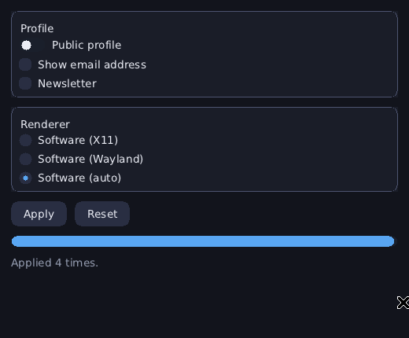

Text layout's proof — the label-mode half of `03_text` at full width
and after the rig narrows the window: the paragraph re-wraps from
five lines to seven and the truncated line's ellipsis moves left
with the edge.

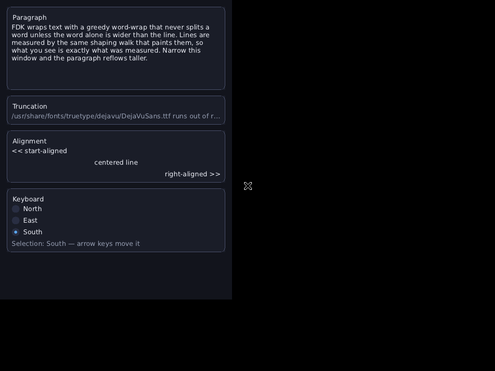
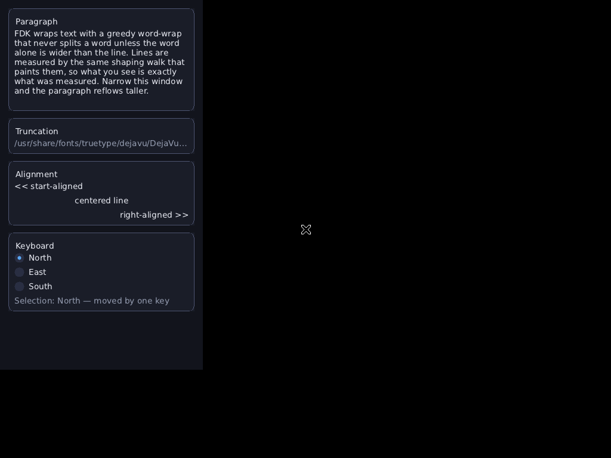

And the theme engine's proof — `05_theme` held under each of its
three themes (built-in FDK Dark, Daylight from a complete `.fdk`
file, Matrix from a deliberately partial one): same widgets, same
layout, same code; only the default theme differs between captures.
The rig also verifies the round trip back to FDK Dark is
pixel-exact.

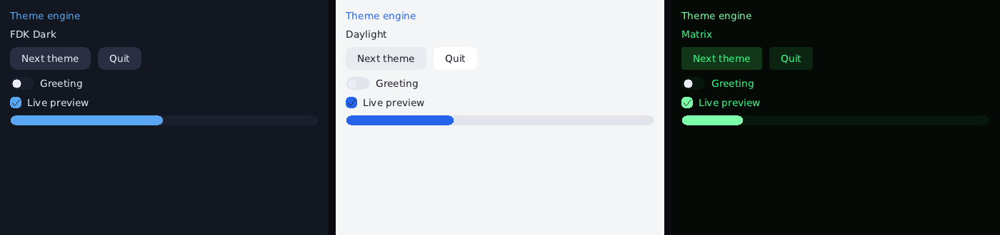

And the decorations' proof — `06_decorations` decorated (note the
FDK band: title, the three management buttons, themed rule — at the
post-drag position) vs. toggled back to WM decorations (band gone,
content reflows to the full window):

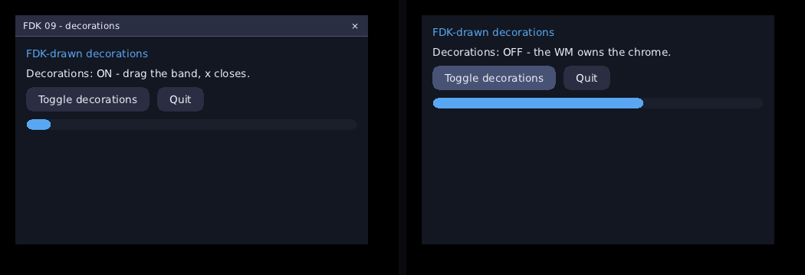

The Phase 8 completion, driven by real input in the test rig:
decorated and dragged; then MAXIMIZED via the band's own maximize
button (fills the screen); then restored by double-clicking the band
and GROWN 460x300 -> 500x330 by dragging the bottom-right resize
corner FDK draws:

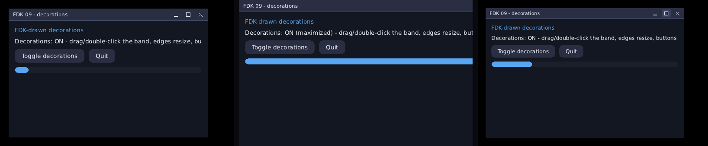

The Phase 9 completion, same rig, same discipline — `07_advanced`
driven by real clicks through the X server: (1) the File menu open
below its bar title — a toolkit-owned popup the demo never paints
itself; (2) a ComboBox dropdown; (3) the modal message dialog (its
own toplevel, grabbing input server-side); (4) a nested submenu
chain, each level its own popup. Escape peels the chain one level
per press; the rig's XQueryTree assertion proves every popup window
left the X server when the chain closed:

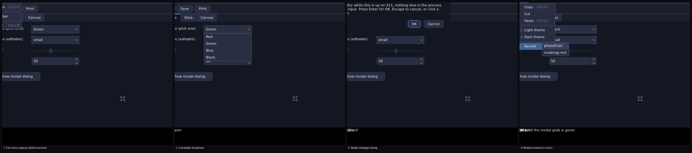

## Project principles

- **No GTK, no Qt, no wrapping either.** FDK implements its own
  widget system, rendering, layout, event handling, and window
  decorations. The X11 and Wayland backends talk directly to Xlib and
  libwayland-client — the two explicitly project-permitted platform
  interfaces — not through any intermediate toolkit.
- **Minimal dependencies, always justified.** Every dependency FDK
  takes on is documented in `docs/dependencies.md` before it's added,
  with license, purpose, and whether it's optional.
- **No copyleft, anywhere in the dependency graph.** See
  `docs/licensing-policy.md`.
- **Correct over quick; architecture over feature-count.** See
  `docs/roadmap.md`'s phase structure — each phase is meant to leave a
  working, tested foundation for the next, not a pile of stubs.
- **No fake completion.** Phase status in `docs/roadmap.md` lists what
  is NOT covered as carefully as what is — e.g. Phase 2 has no
  automated Wayland integration test yet, and says so plainly rather
  than claiming "Wayland support" without qualification.

## Documentation

| Doc | Covers |
|---|---|
| `docs/architecture.md` | Layering, module boundaries, public/internal header split |
| `docs/roadmap.md` | Phase-by-phase plan and current status |
| `docs/build.md` | Build system reference |
| `docs/testing.md` | The two-tier test suite, what each covers, and known environment quirks |
| `docs/memory.md` | Ownership model, allocation policy |
| `docs/threading.md` | UI-thread affinity, worker-thread rules |
| `docs/abi-policy.md` | Current (pre-1.0) ABI stance and the post-1.0 policy |
| `docs/dependencies.md` | Every current and anticipated dependency, with justification |
| `docs/licensing-policy.md` | What licenses are/aren't allowed in, and the audit procedure |

## License

FDK is proprietary software. See `LICENSE` — note that it is currently
a draft flagged for legal review, not a finalized license.
